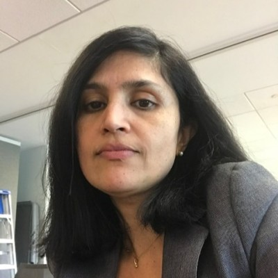

# Vinitha Mahadevan

**Lead Release Train Engineer | SAFe RTE | Agile Transformation Leader**

  

---

## About

Results-driven Lead Release Train Engineer with 20+ years of experience in Agile program management, SAFe implementation, and large-scale technology delivery. Expert in orchestrating continuous planning across the full value stream — from intake and discovery through flow management, value delivery, and Inspect & Adapt embedded within these processes. Proven track record of leading multiple Agile Release Trains (ARTs) across cross-functional teams to drive end-to-end value delivery. Adept at leading distributed teams (onshore/offshore) and partnering with executive leadership to align program execution with strategic business objectives. Driving AI transformation by facilitating AI training using Claude and Claude Code to accelerate delivery and innovation. Deep domain experience across automotive, healthcare, insurance, banking, retail, manufacturing, and logistics sectors.

---

## Core Competencies

| Area | Expertise |
|------|-----------|
| **Agile & SAFe** | PI Planning, ART Execution, Scrum of Scrums, Kanban, Lean-Agile Principles, Inspect & Adapt, Continuous Planning (Intake, Discovery, Flow Management, Value Delivery) |
| **Program Management** | Release Planning, Dependency Management, Risk Mitigation, Capacity Planning, Value Stream Management |
| **AI Transformation** | AI Training Facilitation (Claude, Claude Code), AI Adoption, AI-Augmented Delivery |
| **Leadership** | Coaching & Mentoring, Servant Leadership, Facilitator, Stakeholder Management, Process Re-engineering |
| **Tools** | Jira, Confluence, Rally, MS Project, SAFe, Scrum, Kanban |

---

## Experience

**Lead Release Train Engineer** — Cox Automotive Inc., Roswell, GA *(Apr 2022 – Present)*
  - Orchestrate continuous planning across the full value stream — intake, discovery, flow management, value delivery, and Inspect & Adapt embedded within all processes
  - Drive AI transformation by facilitating AI training using Claude and Claude Code, enabling teams to accelerate development and innovation

**Senior Release Train Engineer** — MerchantE, Alpharetta, GA *(Sep 2021 – Mar 2022)*

**Program Manager** — Anthem, Inc., Greater Atlanta Area *(Jan 2018 – Aug 2021)*

**Program Executive** — Cognizant (Anthem Inc.) *(Mar 2016 – Dec 2017)*

**Portfolio Project Manager** — Cognizant (Sallie Mae) *(Jan 2015 – Feb 2016)*

**Senior Manager** — Cognizant (Express Scripts, Orlando, FL) *(Feb 2013 – Dec 2014)*

**Senior Manager** — Cognizant (Wellpoint, Richmond, VA) *(Oct 2010 – Jan 2013)*

**Project Manager** — Cognizant (BCBSM, NASCO, Wellpoint) *(Oct 2007 – Oct 2010)*

**Senior Programmer Analyst** — Cognizant (WI, MI) *(Jul 2003 – Oct 2007)*

**Technical Software Consultant** — Deutsche Bank *(Jun 2000 – Jul 2003)*

---

## Certifications

- **SAFe 4 Release Train Engineer (RTE)** — Scaled Agile, Inc. *(Oct 2020)*
- **SAFe 4 Advanced Scrum Master (SASM)** — Scaled Agile, Inc. *(Jun 2020)*
- **SAFe 4 Product Owner/Product Manager (POPM)** — Scaled Agile, Inc. *(Jul 2020)*

---

## Education

Bachelor of Engineering, Electrical, Electronics and Communications Engineering — **University of Madras, Chennai**

---

## Recommendations

> *"I worked with Vinitha very closely for almost one year, as she mentored me in the ways of a Release Train Engineer (RTE). She is a very patient teacher. Vinitha always encourages questions, feedback, and new ideas. She has high standards for herself, and expects the same from others. Vinitha is very passionate about her work; any company would be very lucky to have her!"*
>
> **— Karen Heister**, Solutions Engineer Advisor Sr at Elevance Health *(Jan 2022)*

> *"I had the opportunity to work with Vinitha while managing a large BI Program @ Anthem. From the outset, Vinitha's focus on the job and on serving customer was outstanding. She was able to demonstrate her understanding on healthcare domain, translate abstract business requirements and communicate them in an actionable format to offshore team. She was able to work with stakeholders with varied and sometimes overstepping priorities and drive them towards a common goal. Her assertive communication, project management is top notch."*
>
> **— Susanta Praharaj**, Managing Director & Data & AI Evangelist at Accenture *(Oct 2018)*

> *"Vinitha and I worked for many health insurance clients together and she was my manager during those periods. She exhibited a great deal of professionalism and people who know her would be impressed with her assertive communication. She had great knowledge/experience in managing large projects and was known for delivering projects with quality on time within budget. I was always impressed on how she would look out for her resources and care about their health/career goals as well."*
>
> **— Lokesh Purushothaman**, Manager at Deloitte *(Mar 2017)*

> *"I worked with Vinitha on many Data Warehousing projects. She is a very good project manager. She has a pleasant personality, effective, talented, but has the will to drive teams forward where necessary to meet the desired project's goals. She led efforts to develop an Integrated Tracker system for enterprise-level projects, data warehouse enhancement projects as well as small data warehouse change requests. Previously, these efforts existed in three different systems. She was able to successfully pull all that work into a single system. I'd work with Vinitha on any project."*
>
> **— Melvin D. Washington, Jr., PMP, PMI-ACP**, Senior IT Project Manager *(Feb 2013)*

> *"Vinita worked with me on the WellPoint HIP PENDS program. Vinita has a great work ethic, excellent PM skills and is willing to go the extra mile to make sure all issues are addressed timely. Vinita was a pleasure to work with. She reported to me as a PM on the project. After the Go Live, Vinita made sure to work through any warranty issues that were key to the success of this program."*
>
> **— Charles Track MBA**, Director of Product Management at Cigna Evernorth Health Services *(Jan 2013)*

> *"I knew Vinitha for more than three years while she was leading projects for a health insurance client in Michigan. She demonstrated great leadership skills in guiding relatively new team members on successfully completing large complex projects. She was always ready to take a lead on new initiatives that would improve the delivery productivity. Her communication and interpersonal skills have helped getting several leads to new business opportunities. Despite facing several challenges, she showed extraordinary commitment to the success of the team. It was great pleasure working with her, she would make a great asset to any team."*
>
> **— Jambu Saminathan**, Leader in Data Analytics, Credit Risk, Technology Transformation *(Jan 2013)*

---

## Resume

[Download Resume (PDF)](./assets/Resume.pdf)

---

### Contact

**Location:** Roswell, Georgia  
**Email:** vinim2311@gmail.com  
**LinkedIn:** [linkedin.com/in/vinitha-m](https://linkedin.com/in/vinitha-m)
